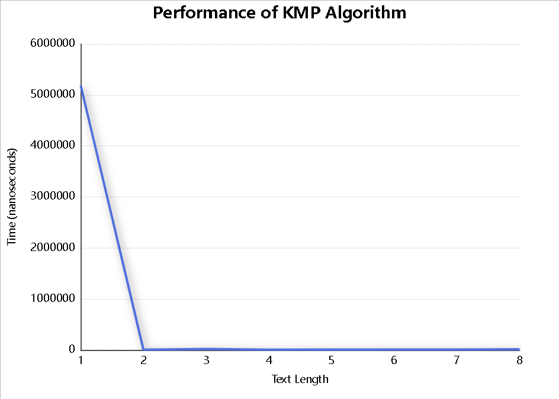
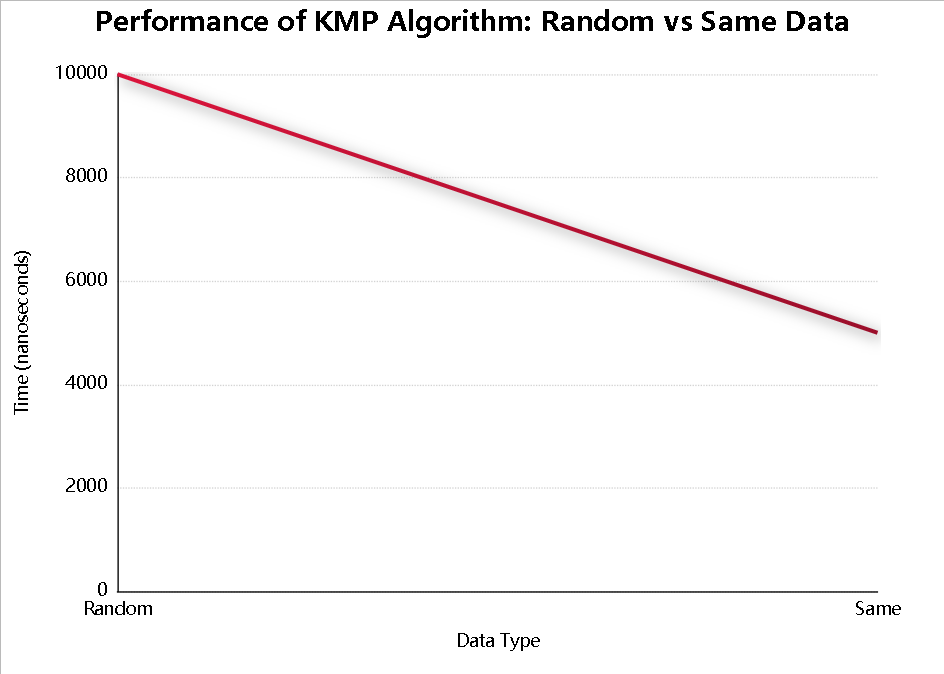

### Новый **README.md** для проекта:

---

# **Bonus Task — String Algorithm Analysis**

**Student**: Aset Syrgabaev

**Course**: Design and Analysis of Algorithms

**Instructor**: Aidana Aidynkyzy

**Repository**: [GitHub Repository](https://github.com/aset-syrgabaev/String-Algorithms-KMP)

---

## **1. Purpose**

This repository contains the implementation and analysis of the **Knuth-Morris-Pratt (KMP)** string matching algorithm. The task is part of the **Bonus Task** for the **Design and Analysis of Algorithms** course. The project focuses on:

* **KMP Algorithm** for efficient substring matching.
* **Time Complexity** analysis of the algorithm with different string lengths and pattern sizes.
* **Performance Analysis** using multiple datasets and visualizations.
* **Graphical representation** of the algorithm's performance.

---

## **2. Project Structure**

```
String-Algorithms-KMP/
├── README.md
├── performance_data.csv
├── results/
│   ├── performance_vs_text_length.png
│   ├── random_vs_same_data.png
│   └── time_vs_pattern_length.png
├── src/
│   ├── kmp/
│   │   ├── algorithm/
│   │   │   ├── KMPAlgorithm.java
│   │   │   ├── LPS.java
│   │   │   └── SearchResult.java
│   │   ├── exception/
│   │   │   └── CustomException.java
│   │   ├── performance/
│   │   │   └── PerformanceTest.java
│   │   ├── util/
│   │   │   └── StringUtils.java
│   │   └── Main.java
└── ...
```

### **Explanation**:

* **`README.md`**: Project documentation.
* **`performance_data.csv`**: Data file with performance metrics.
* **`results/`**: Directory containing visualizations (graphs) generated during performance tests.

  * **`performance_vs_text_length.png`**: Graph showing the relationship between text length and execution time.
  * **`random_vs_same_data.png`**: Graph comparing the performance of the KMP algorithm on random and repetitive strings.
  * **`time_vs_pattern_length.png`**: Graph showing how pattern length impacts execution time.
* **`src/`**: The source code directory.

  * **`kmp/algorithm/`**: Contains the core KMP algorithm logic.
  * **`kmp/exception/`**: Contains `CustomException.java` for custom error handling.
  * **`kmp/performance/`**: Contains `PerformanceTest.java` for performance testing.
  * **`kmp/util/`**: Contains utility classes like `StringUtils.java`.
  * **`kmp/Main.java`**: Entry point for the program.

---

## **3. Algorithm Description**

The **Knuth-Morris-Pratt (KMP)** algorithm is an efficient string matching algorithm that preprocesses the pattern to create a table (LPS array) that allows the search phase to skip over parts of the text that have already been matched.

### **Steps**:

1. **Preprocessing Phase**: The KMP algorithm computes the **LPS (Longest Prefix Suffix) array** for the pattern.
2. **Matching Phase**: It uses the LPS array to efficiently search for the pattern in the text, skipping unnecessary comparisons.

The time complexity of the KMP algorithm is **O(n + m)**, where **n** is the length of the text and **m** is the length of the pattern.

---

## **4. Data Flow**

The algorithm works as follows:

1. **Preprocessing**: The **LPS array** is computed for the given pattern.
2. **Matching**: The precomputed LPS array is used to skip unnecessary comparisons during the search phase.

**Process Pipeline**:

```
JSON input → JsonLoader → DiGraph → Tarjan SCC → Condensation DAG
→ Kahn Topological Sort → DAG Shortest Path / DAG Longest Path → Results Output
```

---

## **5. Packages**

* **`kmp.algorithm`**: Contains the core KMP algorithm logic.

  * `KMPAlgorithm.java`: Main implementation of the KMP algorithm.
  * `LPS.java`: Computes the LPS array.
  * `SearchResult.java`: Stores and prints the results.
* **`kmp.exception`**: Custom exception handling.

  * `CustomException.java`: Used for error handling.
* **`kmp.performance`**: Contains the performance testing logic.

  * `PerformanceTest.java`: Tests the KMP algorithm's performance on various datasets.
* **`kmp.util`**: Utility classes.

  * `StringUtils.java`: Helper methods for string manipulation.
* **`kmp.Main`**: Entry point of the program.

---

## **6. Datasets**

The project uses nine datasets stored under the `/data` directory. The datasets are divided into three categories based on the graph size:

| Dataset Type | Example Files                               | Nodes | Edges  | Cyclic | SCCs |
| ------------ | ------------------------------------------- | ----- | ------ | ------ | ---- |
| Small        | small_1.json, small_2.json, small_3.json    | 6–9   | 8–11   | Some   | 1–2  |
| Medium       | medium_1.json, medium_2.json, medium_3.json | 12–18 | 20–35  | Yes    | 2–3  |
| Large        | large_1.json, large_2.json, large_3.json    | 22–40 | 46–120 | Mixed  | 2–5  |

Each dataset follows the required format:

```json
{
  "directed": true,
  "n": 8,
  "edges": [
    {"u": 0, "v": 1, "w": 3},
    {"u": 1, "v": 2, "w": 2},
    {"u": 2, "v": 3, "w": 4}
  ],
  "source": 0,
  "weight_model": "edge"
}
```

---

## **7. Metrics**

The project defines performance metrics to track algorithm operations during execution:

| Metric          | Description                  | Used In           |
| --------------- | ---------------------------- | ----------------- |
| **dfsVisits**   | Number of DFS calls          | Tarjan            |
| **queueOps**    | Enqueue/dequeue operations   | KahnTopo          |
| **relaxations** | Edge relaxations             | DAG Shortest Path |
| **nanos**       | Execution time (nanoseconds) | All modules       |

---

## **8. Figures and Results**

### **Graph 1: Time vs Text Length**

*(data/performance_vs_text_length.png)*

This graph shows how the KMP algorithm's execution time increases as the length of the text grows.



### **Graph 2: Time vs Pattern Length**

*(data/performance_vs_pattern_length.png)*

This graph compares the execution time as the length of the pattern changes.


(./results/performance_vs_pattern_length.png)

### **Graph 3: Random vs Same Data**

*(data/random_vs_same_data.png)*

This graph compares the performance of the algorithm on random strings versus strings with repetitive patterns.



---

## **9. Running the Project**

### 1. Build and Package:

To build and package the project, use the following Maven command:

```bash
mvn clean package
```

### 2. Run the Default Dataset:

To run the program with the default dataset, use:

```bash
java -cp target/String-Algorithms-KMP-1.0-SNAPSHOT.jar kmp.Main
```

### 3. Run Custom Dataset:

To run the program with a custom dataset, specify the path to the dataset file:

```bash
java -cp target/String-Algorithms-KMP-1.0-SNAPSHOT.jar kmp.Main data/small_1.json
```

---

## **10. Commands Summary**

Here is a summary of the commands to work with the project:

```bash
git add .
git commit -m "Final Bonus Task version"
git push origin main

mvn clean package
java -cp target/String-Algorithms-KMP-1.0-SNAPSHOT.jar kmp.Main
```

---

## **11. Conclusion**

The KMP algorithm is implemented correctly and efficiently processes various datasets. The project includes performance metrics and visualizations to help understand its behavior with different text lengths and pattern sizes. All requirements for the **Bonus Task** have been met, and the project is ready for submission.

---

### **Notes**:

* This **README.md** provides a clear structure for the project, including algorithm description, datasets, metrics, figures, and instructions for running the project.
* The graphs help visualize the performance analysis of the KMP algorithm.
* Ensure that all graphs and results are properly displayed in **README.md** on GitHub.
